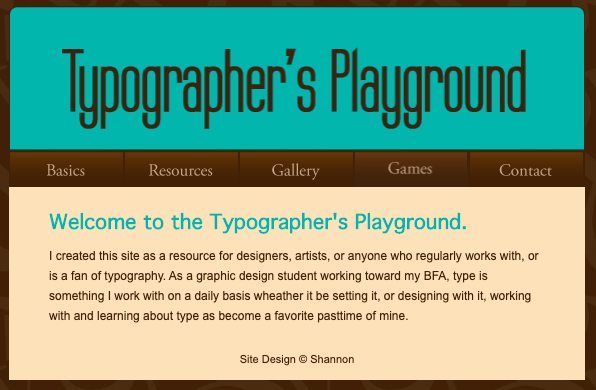

# Typographer's Playground

Revisiting old projects and updating is a great way to put new skills into practice. This project is the first website I ever build and has not been touched since around 2009. That's pracically an _eon_ in web years.

Since this is the oldest digital project of mine I could find, I thought it would be a ~~terrifying~~ fun one to revist, rework and see if it can be something worth keeping up to date.

Here's a taste of what the homepage looks like in all it's 2009 glory.

😱

Stay tuned